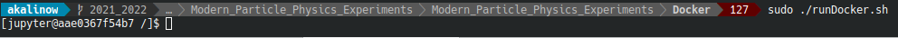
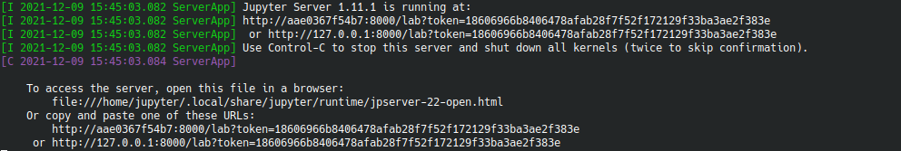

Instructions for starting a Docker service at a local computer. 
The Docker service allows to run all the code we need on a local machine. The Docker service will run an ```image```
containing all the necessary software packages.

Full list of the packages available in provided image can be found [here](https://hub.docker.com/r/akalinow/root-fedora35)


1. Instructions how to install the Docker application on 
[Linux](https://docs.docker.com/install/linux/docker-ce/fedora/), 
[Windows](https://docs.docker.com/docker-for-windows/),
[MacOS](https://docs.docker.com/docker-for-mac/install/)

**Note**: after the installation one has to restart the computer.

2. Dowload and run the ```runDocker``` script for [Windows](runDocker.bat), and [Linux, MacOS](runDocker.sh) 
   to start the container.

3. After starting the container one gets acces to a terminal window:




4. Start the jupyter server with the ```start_jupyter.sh``` command:


In the terminal window you will see an information that server has started, and is available under given URL:



Please copy the URL starting with "127.0.0.1" to web browser to start the jupyter client.

5. All files created within the container in ```scratch``` directory are visible in the host system:
on Windows on the desktop in directory ```Docker```, on Linux in the root directory, ```\```.


