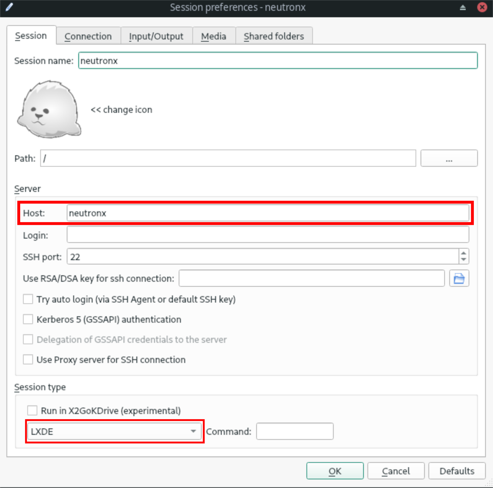
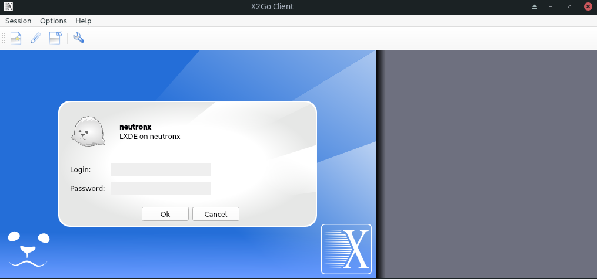

# Run instructions

During the class we will use multiple packages and programs specific for high energy physics. To avoid the burden of installing and configuring them on every machine, we will use virtual environments known as containers. 

You can check the full list of packages installed in the image we will use: [akalinow/root-fedora35](https://hub.docker.com/r/akalinow/root-fedora35).

## Running at computer lab

During classes at the computer lab we will use Apptainer/Singularity containers. 

### Connect to server 
Connect to `neutronx` server using `x2goclient` application:

```
x2goclient
```

If needed create new session:
- host - `neutronx`,
- session type - `LXDE`,



Then open the session with your credentials.



After that a new window with your desktop on the server should appear.

### Run Apptainer/Singularity

**During the first lecture use a quick recipe:**

```
cp ~akalinow/Public/910f0274fbf1c39f2d739ab5a3ac6872019c230cf1c1b102b83e2c871c2f4f21 ./
./910f0274fbf1c39f2d739ab5a3ac6872019c230cf1c1b102b83e2c871c2f4f21
```

Later (from home) please create your own version of the above file:

* download the starting script:

```sh
wget https://raw.githubusercontent.com/akalinow/Modern_Particle_Physics_Experiments/2021_2022/Docker/runSingularity.sh
 ```

* at the first run the file is created, and you may encounter following error 'FATAL:  ... no space left on device'. In that case try:

```sh
mkdir -p $HOME/tmp
APPTAINER_TMPDIR=$HOME/tmp . runSingularity.sh
```

* any other time just run:

```sh
. runSingularity.sh
```

After this command, the prompt should change to `Apptainer>` which indicates that you are now inside the container.

Inside the container you can start the `jupyter-lab` with:

``` sh
jupyter-lab 
```

The `jupyter` should write a bunch of lines to the terminal. Find and copy the URL starting with `http://127.0.0.1`, then open a web browser and paste it.

## Running on private computer

You can also install the software necessary to run containers on your private computer.

Depending on your system you can use either Apptainer/Singularity (Linux) or Docker (Windows, MacOs, Linux).

### Apptainer/Singularity (Linux only)

[Installation instructions](https://apptainer.org/user-docs/master/quick_start.html). Once installed you should be able to start it the same way as [at computer lab](#run-apptainersingularity).

### Docker (Windows, MacOs, Linux)

1. Installation instructions:

    - [Windows](https://docs.docker.com/docker-for-windows/),
    - [MacOS](https://docs.docker.com/docker-for-mac/install/),
    - [Linux](https://docs.docker.com/install/linux/docker-ce/fedora/).
    
    **Note**: after the installation one has to restart the computer.

2. Download the starting script and run it to start the container:
    - [runDocker.bat](runDocker.bat) on Windows,
    - [runDocker.sh](runDocker.sh) on MacOS and Linux:
        ```sh
        # download
        wget https://raw.githubusercontent.com/akalinow/Modern_Particle_Physics_Experiments/2021_2022/Docker/runDocker.sh
        # run
        . runDocker.sh
        ```

3. After starting the container one gets access to a terminal window:

    

4. Start the `jupyter-lab` with the `start-jupyter.sh` command:

    ```sh
    cd
    ./start-jupyter.sh
    ```

    In the terminal window you will see an information that server has started, and is available under given URL:

    

    Please copy the URL starting with `http://127.0.0.1` to web browser to start the jupyter client.

5. All files created within the container in `scratch` directory are visible in the host system:
    - on Windows in directory `Docker` located in the user directory,
    - on Linux in the root directory, `\`.

